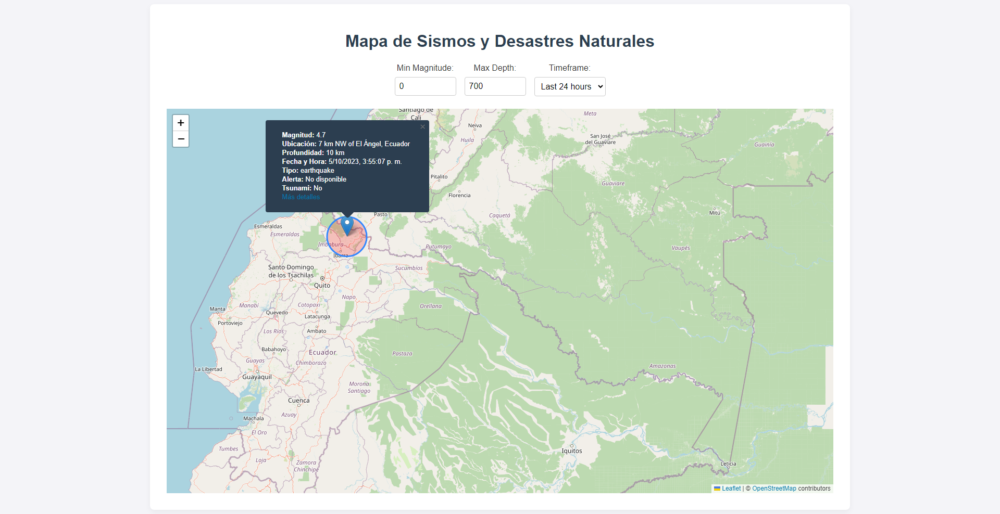

 # Mapa de Sismos y Desastres Naturales
 
 Una aplicación React para visualizar terremotos y otros desastres naturales en un mapa interactivo. Utiliza la API de USGS para obtener datos en tiempo real.
 
 ## Características
 
 - **Filtrado Dinámico**: Filtra terremotos por magnitud, profundidad y marco temporal.
 - **Visualización Interactiva**: Cada terremoto se representa como un marcador en el mapa. Haz clic en un marcador para obtener más detalles.
 - **Estilización Personalizada**: Diseño limpio y estilizado con una combinación de colores atractiva.
 
 ## Vista previa
 
 
  
 ## Cómo empezar
 
 1. Clona este repositorio:
 ```
 git clone https://github.com/tu-usuario/tu-repositorio.git
 ```
 2. Instala las dependencias:
 ```
 npm install
 ```
 3. Inicia la aplicación:
 ```
 npm start
 ```
 
 ## Tecnologías utilizadas
 
 - [React](https://reactjs.org/)
 - [TypeScript](https://www.typescriptlang.org/)
 - [Leaflet](https://leafletjs.com/)
 - [Axios](https://axios-http.com/)
 
 ## Contribuciones
 
 Las contribuciones son bienvenidas. Si encuentras un error o tienes alguna sugerencia, no dudes en abrir un *issue* o enviar un *pull request*.
 
 ## Licencia
 
 MIT
